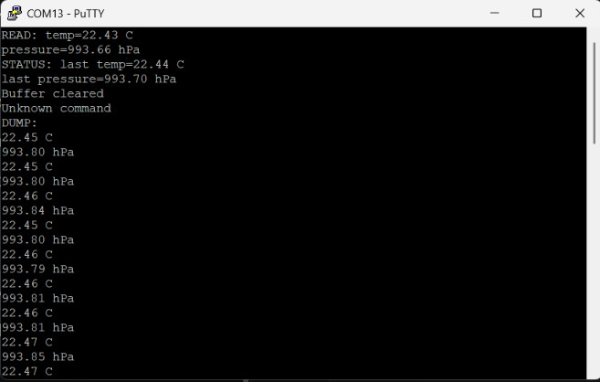

# STM32F446RE BMP280 Environmental Telemetry Node

A bare-metal, register-level embedded telemetry system built entirely from scratch — no HAL, no RTOS. Streams and logs live temperature/pressure data from a BMP280 sensor, accessible through a non-blocking, interrupt-driven UART command-line interface.

## Features

- **Register-level I2C1 driver** — custom-built from the STM32F446 reference manual, no HAL abstraction layer
- **Bosch fixed-point compensation math** — temperature and pressure conversion implemented directly from the BMP280 datasheet's t_fine algorithm
- **Non-blocking 1Hz sampling** — driven by a TIM6 hardware interrupt; the CPU is never stuck in a busy-wait delay loop
- **Zero-heap circular ring buffer** — fixed-size sample history with no malloc, safe for long-running embedded operation
- **Interrupt-driven UART CLI** — USART2 RX interrupt assembles typed commands character-by-character, parsed and dispatched at runtime:
  - READ — on-demand live sensor read
  - STATUS — most recently logged sample
  - DUMP — non-destructive dump of full sample history
  - CLEAR — flush the sample history buffer

## Hardware

| Signal | MCU Pin | Peripheral |
|---|---|---|
| I2C SCL | PB8 | I2C1 |
| I2C SDA | PB9 | I2C1 |
| UART TX | PA2 | USART2 (ST-LINK VCP) |
| UART RX | PA3 | USART2 (ST-LINK VCP) |

- **MCU:** STM32F446RE Nucleo-64
- **Sensor:** GY-BMP280 breakout, I2C address 0x76
- **Serial:** 115200 baud, 8N1, via ST-LINK Virtual COM Port

## Architecture

    drivers/        Generic, reusable register-level STM32F446 peripheral drivers
                     (GPIO, I2C, USART, RCC) — no project-specific knowledge

    Src/, Inc/
      app_init.c/h       Project-specific peripheral configuration (I2C1, USART2, TIM6)
      bmp280.c/h         BMP280 sensor driver: chip-ID, calibration, raw read, compensation
      ring_buffer.c/h    Fixed-size circular buffer for logged sensor samples
      rx_ring_buffer.c/h Fixed-size circular buffer for incoming UART bytes
      cli.c/h            Command-line assembly and dispatch (READ/STATUS/DUMP/CLEAR)
      uart_utils.c/h     Fixed-point decimal UART print formatting
      main.c/h           Application entry point: init, ISRs, main loop

The design separates generic peripheral drivers (reusable on any project targeting this MCU) from application-specific logic, and keeps interrupt service routines minimal — each ISR only flags work or moves a byte; all real processing happens in the main loop.

## Usage

Connect via a serial terminal (PuTTY, Tera Term) at 115200 8N1. The sensor samples silently in the background at 1Hz; nothing prints until a command is issued.

    > STATUS
    STATUS: Temp=29.41 C Pressure=993.54 hPa

    > READ
    READ: Temp=29.42 C Pressure=993.46 hPa

    > DUMP
    DUMP:
    29.42 C  993.56 hPa
    29.43 C  993.56 hPa
    ...

    > CLEAR
    Buffer cleared

    

## Build

Built with STM32CubeIDE. Clone the repo and import as an existing CubeIDE project, or build from the command line with arm-none-eabi-gcc using the included .cproject/linker script.

## What's not included

Flash-based persistent logging across power cycles was scoped out of this version — the ring buffer holds a 60-sample rolling history in RAM, which covers the CLI's use case without the added complexity of flash sector write/erase handling. A natural extension for a v2.

## Notable engineering details

- Discovered and fixed a subtle I2C ACK-enable ordering bug: the ACK control bit must be set after the I2C peripheral enable (PE) bit, not before — writing it during I2C_Init() (before I2C_PeripheralControl(ENABLE)) silently failed to take effect, causing multi-byte reads to NACK after the first byte.
- Verified I2C bus idle state (SDA/SCL should sit high via pull-ups when the bus is not active) by reading GPIO_IDR directly in the debugger, since no multimeter or oscilloscope was available — confirming correct pull-up wiring before trusting any I2C transaction behavior.
- UART RX interrupt and command parsing are fully decoupled from the sensor's 1Hz sampling loop — both operate independently without blocking each other, demonstrated by STATUS always reflecting the latest background sample regardless of CLI activity.
